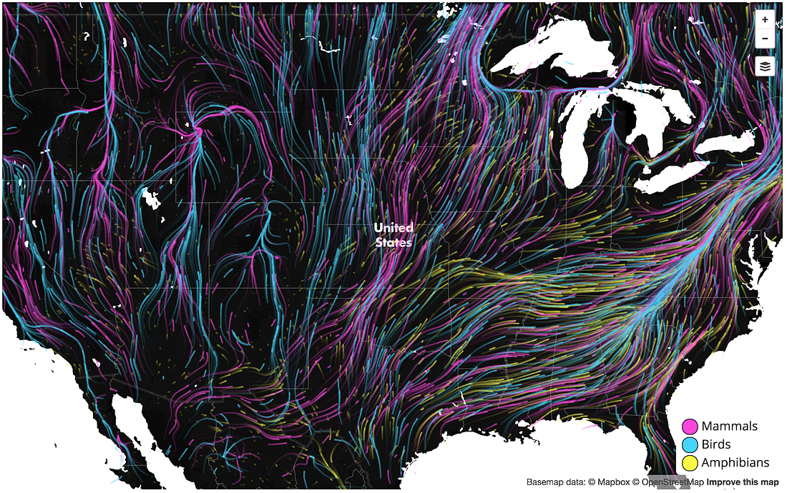
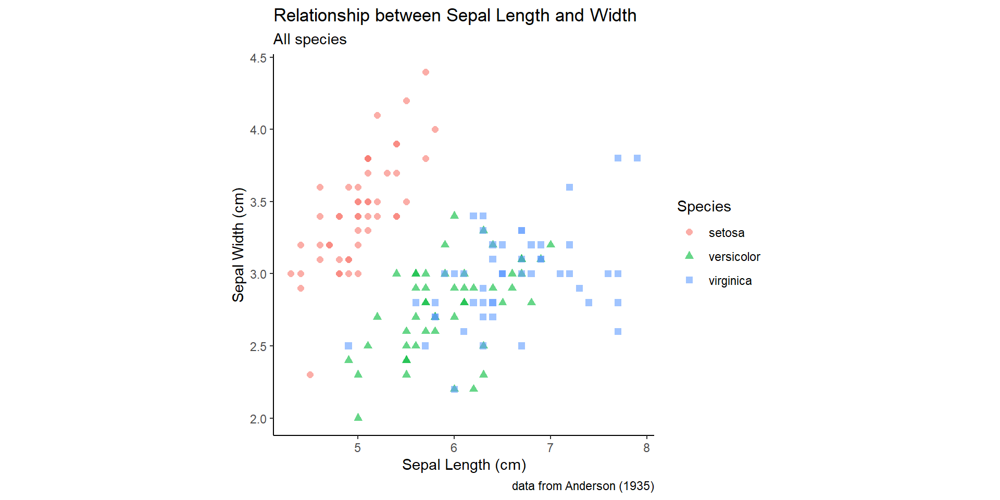
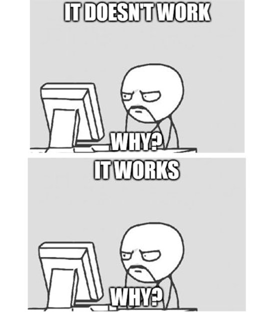

## Share some data

Go to the [ENV 170 Week 1 Google Jamboard link](https://jamboard.google.com/d/1DXk2lFvbiJCHGhfSuaqclX1wOo067evowlLh47SNfN8/edit?usp=sharing "Week 1 Jamboard") and answer the following:

1.  What is your major/program of study?

2.  What do you hope to get out of ENV 170?

3.  Where is your favorite place to eat on or near the Tufts campus?

## About us

::: columns
::: {.column width="50%"}
**Instructor**\
Ben Davies\
benjamin.davies\@tufts.edu
:::

::: {.column width="50%"}
**Teaching Assistant**\
Courtney King\
courtney.king662186\@tufts.edu
:::
:::

## About this course

This course is designed to develop skills and knowledge needed to assemble, manage, visualize, analyze, and communicate about environmental data. Students will learn fundamental data science concepts and computational techniques needed to

-   access data from a variety of sources;

-   organize and reshape datasets to suit different purposes;

-   plot data to evaluate patterns;

-   assess the robustness and uniqueness of those patterns;

-   share their findings to different audiences.

## 


## About this course

Students will also explore how aesthetic design choices contribute to the usefulness of visualizations for telling environmental stories and best practices for making data and open and accessible for public reuse.

## Why use data to build narratives?





## 

 NASA Scientific Visualization Studio (https://svs.gsfc.nasa.gov/5137/)

## 



## 

 at the George Washington University (<https://onlinepublichealth.gwu.edu/resources/climate-change-emissions-data/>)](InClassStatic/Climate_Change_carbon_v_vulnerability.png){fig-align="center"}

## How we get there

::: columns
::: {.column width="50%"}
{width="391"}
:::

::: {.column width="50%"}

:::
:::

## How we get there


::: {.cell}

```{.r .cell-code}
library(ggplot2)


sepal.labels <- labs(x = "Sepal Length (cm)", y = "Sepal Width (cm)",
                     title = "Relationship between Sepal Length and Width",
                     caption = "data from Anderson (1935)")
my.theme <- theme_classic()  + theme(aspect.ratio = 1)

all.sepals <- ggplot(iris, aes(x = Sepal.Length, y = Sepal.Width))

all.sepals + 
  geom_point(aes(color = Species, shape = Species), size = 2, alpha = 0.6) +
  sepal.labels + labs(subtitle = "All species") +
  my.theme
```
:::


## How we get there


::: {.cell}
::: {.cell-output-display}
{width=960}
:::
:::


## Why use R?

::: incremental
-   R is a versatile software platform focused on data and visualization

-   R is free to use

-   **R has a large and active user base**
:::

## What we need from you

::: incremental
-   Be respectful

-   Attend lectures and recitations

-   Submit assignments on time

-   If there is something you don't understand or want to know more about, say so

-   If you hear something you disagree with, say so
:::

## Learning how to ask questions

::: columns
::: {.column width="60%"}
"Beginners face a language problem: they can't ask questions because they don't know what the words mean, they can't know what the words mean until they can successfully use the system, and they can't successfully use the system because they can't ask questions."

-Phil Agre, *How to help someone use a computer*
:::

::: {.column width="40%"}

:::
:::

## Course assessment


::: {.cell}
<style type="text/css">
.reveal table {
  font-size: smaller;
}

</style>
:::


| Assessment             | Weight | Due Dates     | Week Number           |
|------------------------|--------|---------------|-----------------------|
| Lab exercises          | 30%    | Weekly        | Weeks 1 - 12          |
| Coding assignments     | 25%    | Varies        | Weeks 4, 6, 8, 10, 12 |
| Visualization critique | 10%    | Varies        | Starting Week 4       |
| Project proposal       | 5%     | October 17th  | Week 7                |
| Project notebook       | 15%    | November 30th | Week 13               |
| Project poster         | 15%    | December 7th  | Week 14               |

## Resources


## Questions?

